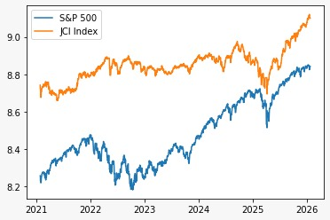
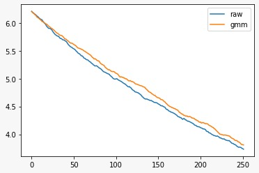
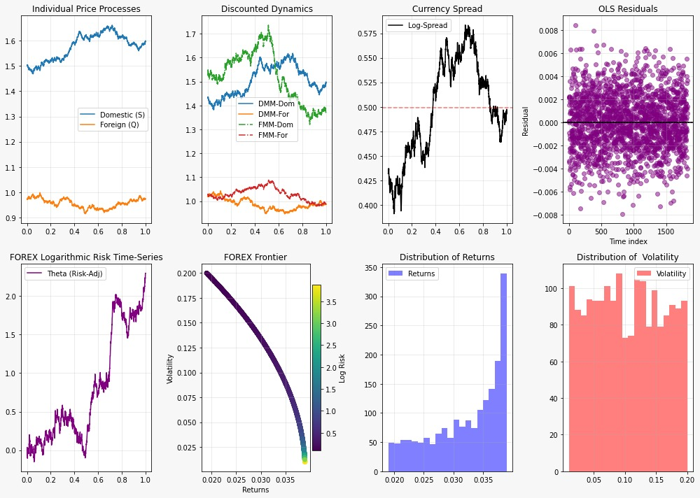
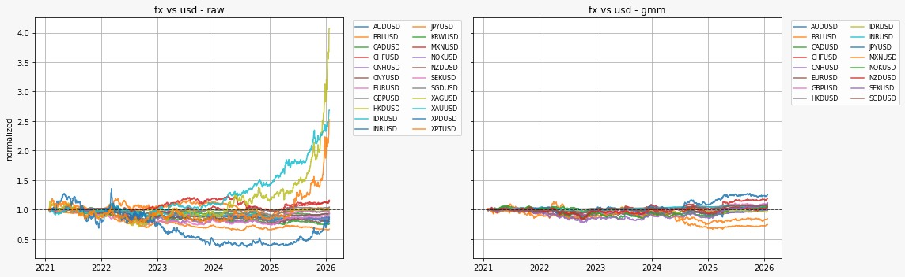

# Quant GMM - 0.1
## Outline of Rep
This rep is a personal project, for the applications of Generalized Methods of Moments, in the style of John Cochrane (2005) to financial data and models. The model stems from his book _Asset Pricing_, and this rep samples some well known diffusion models in finance and applied GMM methods to the moment statistics to those diffusion moments. This rep was inspired by my time in studying asset pricing , quantitative finance, and mathematical statistics in which I aggregated the codes into a python Import folder that can be used. The folder [GMM](gmm) makes each base models in the folder named [base_models](gmm/base_models) as python class as a GMM model of each of the models moments via the [models](gmm/models) folder. A simple test of the models has been implemented by the use of YahooFinance plugin in python in the folder [model_tests](gmm/model_tests). Example applications to empirical data are present in the jupyter notebooks with initials ex. in the [main directory](https://github.com/glvn5150/quant_gmm). The intentions of the model is thus, to have a unify GMM framework from sample models that has essential diagnostic plots for each model tested. 

The rep's models:
- Geometric Brownian Motion : $dx_t/x_t = (\mu - \frac{1}{2} \sigma^2)dt + \sigma dW_t$,
- General OU processes : $dx_t = \kappa(\theta - x_t)dt + \sigma dW_t$,
- Vasicek : $dr_t = a(\theta - r_t)dt + \sigma \,dW_t$,
- CIR : $dr_t = a(\theta - r_t)\,dt + \sigma \sqrt{r_t}\,dW_t$,
- Hull–White $dr_{t}=[\theta (t)-ar_{t}]dt+\sigma dW_{t}$,
- Black–Derman–Toy : $d \log r_t = (\theta_t + \frac{\sigma'}{\sigma} \log r_t) dt + \sigma dWt$,
- Black–Scholes–Merton : $SN(d_1) - e^{-r^{f}} K N(d_2)$,
- Linear SDF asset pricing models $\mathbb{E}[m_t R_{i,t} - 1] = 0$,
- Forex models $dQ/Q = (r^f - r + \gamma) dt + \sigma dW_t$

The rep also has its limitations, by which it:
- Moment conditions are hand-specified and model-dependent.
- Weighting matrices rely on simple identity or HAC estimators.
- Inference assumes standard asymptotic GMM conditions.
- Monte Carlo–based moments introduce simulation noise.
- No explicit identification or rank diagnostics are implemented.
- Diffusion models rely on discretized dynamics.
- Instrument selection is manual and model-specific.
- Numerical stability is handled pragmatically rather than optimally.
- The framework is not optimized for large-scale or production use.
  
## First Principles of GMM
GMM starts with a vector of moments condition via function $g_t(\theta) \in \mathbb{R}^k$ in k-dimensions and parameters $\theta \in \mathbb{R}^p$ in p-dimensions, such that
```math
\mathbb{E}[g_t(\theta)] = 0
```
Cochrane's Asset Pricing defines the price of an asset as $p = \mathbb{E}[m_t x_t]$, where $m$ is the discount factor of the asset price. The $g$ is defined as the expected value of the sample mean of $u_t$ errors such that : 
```math
g_T(b) = \mathbb{E}[u_t(b)] = \mathbb{E}[m_{t+1}(b) x_{t+1} - p_t]
```
The estimator is via matrix weight $W$: 
```math
\hat{\theta} = \arg\min_\theta \; \bar g_T(\theta)^\top W \bar g_T(\theta)
```
GMM has 1-step GMM and 2-step GMM, where the matrix weight $W=I$ for the 1-step, and the 2-step has $W = S^{-1}$ where $S = \mathbb{E}[g_t g_t^\top]$. The tests of significance of this statistical moments is via the J-statistic, which is:
```math
J = T \cdot \bar g_T(\hat\theta)^\top \hat W \bar g_T(\hat\theta)
```
The J-stat has null-hypothesis of $H_0: \mathbb{E}[g_t(\theta_0)] = 0$, and converges to a distribution $d$ of a Chi-Square type $J \xrightarrow{d} \chi^2_{q - p}$ where $q,p$ is the number of moments and paramters respectively. The Newey-West covariance is via $\hat S_{\text{NW}}=\sum_{k=-L}^L w_k \hat\Gamma_k$, where $\Gamma_k = \mathbb{E}[g_t g_{t-k}^\top]$ which adds robust to autocorrelation and heteroskedasticity. 
The typical implementation for a GMM is thus in Python:
```python
class GMMBase:
    def moments(self, params, data): #return the moments parameters 
        pass
    def objective(self, params, W, data):
        g = self.moments(params, data)
        g_bar = g.mean(axis=0)
        return g_bar.T @ W @ g_bar
    def fit(self, data, x0):
        W1 = I #1st stage
        params1 = minimize(self.objective, x0, args=(W1, data))
        g = self.moments(params1, data) #second stage
        S = cov(g)
        W2 = inv(S)
        params2 = minimize(self.objective, params1, args=(W2, data))
        return params2
```
## Example - Stock Market Correlations
Simple illustration of a model is to consider say the spread between two equity index (or any asset types but let's use these for simplicity) such as the JCI and S&P. Basically we have moments according to asset pricing, with parameter $\beta$, we can formulate:
```math 
x_t \;=\; \log(\text{JCI}_t) \;-\; \beta\,\log(\text{S\&amp;P}_t)
```
Continous time spread can be model using OU for mean-reverting aspects (for example), as:
```math 
dx_t = \kappa(\theta - x_t)\,dt \;+\; \sigma\,dW_t
```
This has the formulation of $\text{JCI}_t \approx \beta\,\text{S\&amp;P}_t \times e^{x_t}$, in which the S&P is the global factor, and the $x_t% is the global deviation between the JCI and S$P.This corresponds to a form $\Delta x_t = -\kappa x_{t-1} + \kappa\theta + \varepsilon_t$, in which is akin to a VECM with one cointegrating vector. The GMM theoretically, means:
```math
\mathbb{E}[dX_t] = \kappa(\theta - \mathbb{E}[X_t])\,dt
```
The moment condition is:
```math
g_1 = \bar{dX} - \kappa(\theta - \bar X)\,dt = 0
```
The figure below shows the plot of both indexes, as well when the OU is modelled as a spread. As the mean reversion gets bigger, the markets integrated, arbitrage effective in which the factor is akin to a half-life of $\ln2 / \kappa$. The smaller the mean reversion, the more valuation gaps are persistent. The GMM and raw model is akin although one is slightly bigger. The equilibirum is thus via $\theta$ where more than 0, Indonesia structurally trades at premiums.




## Example - Foreign Exchange Correlations
The file [foreign_domestic_pricing](gmm/model_base/foreign_domestic_pricing.py) implements a forex model into financial data. The forex model uses a diffusion model of:
```math 
\begin{aligned}
d \log S_t = \alpha \, dt + \sigma_1 \, dW_t^S \\
d \log Q_t = (r - r_f + \gamma)\, dt + \sigma_2 \, dW_t^Q
\end{aligned}
```
where $\alpha$ is the domestic drift, $\gamma$ is the forex risk premium, $r - r_f$ is the carry term (I used real interest rates), $sigma_i$ as volatility, and $\rho = \mathrm{corr}(dW^S, dW^Q)$. The python file [foreign_domestic_pricing_gmm](gmm/model_base/foreign_domestic_pricing_gmm.py) elaborates the moments with $dX_t = \Delta \log X_t$ for $X \in (S,Q)$ and drift $\alpha = \mu_S - \tfrac{1}{2}\sigma_1^2$ and $\gamma = \mu_Q - \tfrac{1}{2}\sigma_2^2$ as:
```math
\begin{aligned}
m_{1t} = dS_t - \alpha \Delta t \\
m_{2t} = dQ_t - (r - r_f + \gamma)\Delta t \\
m_{3t} = dS_t^2 - \sigma_1^2 \Delta t \\
m_{4t} = dQ_t^2 - \sigma_2^2 \Delta t
\end{aligned}
```
The GMM is thus stacked in a 4D array:
```math
g_t(\theta) =
\begin{bmatrix}
m_{1t} \\
m_{2t} \\
m_{3t} \\
m_{4t}
\end{bmatrix}
\in \mathbb{R}^4
```
The outline code has:
```python
class FX_GMM:
    def moments(self, params, logS, logQ):
        alpha, gamma, sigma1, sigma2 = params
        g1 = logS - alpha*dt
        g2 = logQ - (r - rf + gamma)*dt
        g3 = logS**2 - sigma1**2*dt
        g4 = logQ**2 - sigma2**2*dt
        return [g1, g2, g3, g4]
```
The python file has also includes instruments $Z$ for multi or cross-sectional implementation of different currencies (say analyzing the Dollar to other currencies that has ratio to the dollar like Euros, IDR, etc. and it's inverse), so that $\mathbb{E}\big[ Z_t \, m_t(\theta) \big] = 0$. The notebook [ex2_global_fx.ipynb](ex2_global_fx.ipynb) contains the full code implementation, in which I normalized the values to $ \tilde{X}_t = X_t / X_0$ and thus $\log \tilde{X}_t = (\mu_X - \tfrac12\sigma_X^2)t + \sigma_X W_t$.

This figure below implements it as a simple demonstration without GMM how the base code works, in which the instruments are USD/JAP and EUR/USD. The DMM and FMM follows Shreeve (2004) in Chapter 9, where he elaborates the mechanics and math behind the domestic and foreign money market under numeraire, in which I implemented it instead of to stocks but to directly to Forex. 


This figure and table below is the results of implementation to multi-currencies. Although the data is using moments that are highly correlated (USD/AUD and AUD/USD) for example, and not adding "new" information for the test to fail on, The GMM method successfully estimated parameters such that the average of the moment conditions over the entire period is statistically not that different to zero, and by such The J-stat in the samples are really small as a result. The figure shows the raw moments implemented in which it "explodes" for some currencies, while the moments after the GMM is normalized around one, suggesting the GMM estimation has found parameters that make the moments behave as white noise (unpredictable, with a constant average of zero in expectation). 



| pair | foreign | rf | gamma_sample | gamma_gmm | sigma2 | jstat |
| :--- | :--- | :--- | :--- | :--- | :--- | :--- |
| AUDUSD Curncy | AUD | 0.0150 | -0.019289 | -0.020010 | 0.087139 | 6.276963e-07 |
| BRLUSD Curncy | BRL | 0.0450 | -0.002360 | 0.027947 | 0.118605 | 5.657920e-07 |
| CADUSD Curncy | CAD | 0.0125 | -0.011452 | -0.016904 | 0.054414 | 2.031796e-07 |


# Books used and further reading:
- Cochrane, J. H. (2005). Asset pricing (Rev. ed.). Princeton University Press.
- Shreve, S. E. (2004). Stochastic calculus for finance II: Continuous-time models. Springer.
- Rémmilard, B. (2019). Statistical methods for financial engineering. Chapman and Hall/CRC.
